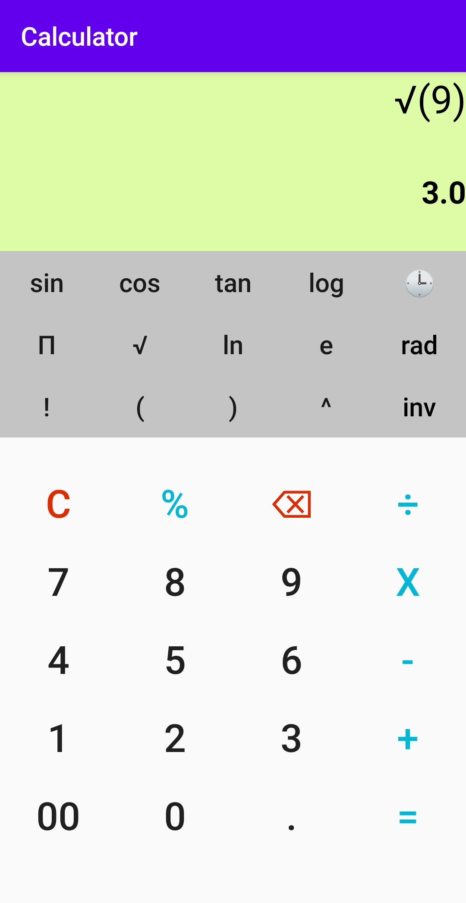
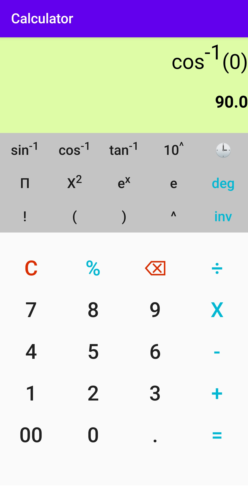
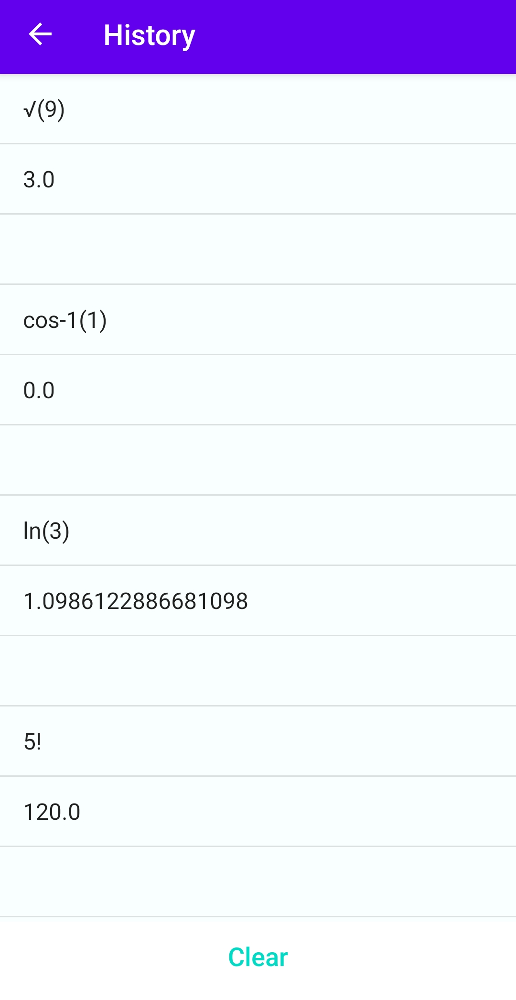

# Android Calculator Application
A minimalistic calculator app that performs all the major operations including evaluating expressions and fundamental trigonometric, exponential, logarithmic operations.
The app also supports factorial, square root and inverse operations with a dedicated degree/radian option for trigonometric calculations.

 

  
The app also has a section for viewing previously done calculations that stores all the expressions with their results as evaluated during a particular session.
It also contains a **CLEAR** button that will delete the history.

  
For evaluating expressions, **mXparser Api** is used that is a super easy, rich, fast and highly flexible math expression parser library.
Documentation can be found [here](http://mathparser.org/)

***minSdkVersion: 21*** 
***targetSdkVersion: 30***
